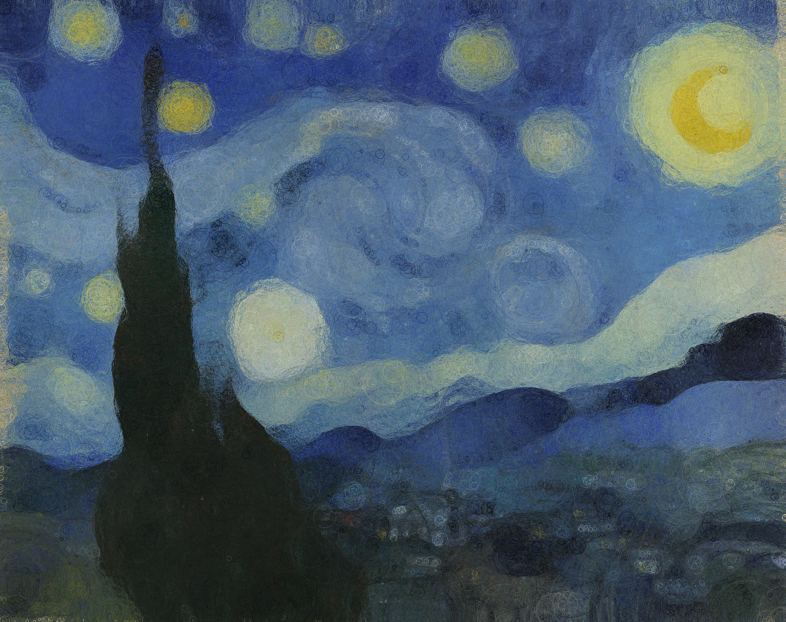

# circlez

A variation of the [linez](https://github.com/Patryk27/linez) project that approximates images using circles instead.


<p align="center">
  
</p>

<p align="center">
  
</p>

## Usage

```shell
$ git clone https://github.com/AnarchistHoneybun/circlez.git
$ cd circlez
$ cargo run --release -- path/to/your/image.jpg
# (press escape to save and close the app)
```

Generated images are automatically saved in the `generated_images` folder with the suffix `_circlez.jpg`.

## Algorithm

1. Load the target image provided by the user
2. Create a black canvas for the approximation
3. Sample a circle by:
    - Randomizing a center point
    - Randomizing a radius (limited to 1/4 of the smaller image dimension)
    - Randomizing a color
4. Check if drawing this circle would reduce the distance between the approximation and target image
5. If it improves the approximation, draw the circle; otherwise discard it
6. Return to step 3
7. When the program is closed (via ESC key), save the final result

The distance between images is calculated using mean squared error in RGB space:

```
def image_distance(img_a, img_b):
    assert img_a.size() == img_b.size()
    
    dist = 0.0
    
    for all pixels in img_a and img_b:
        dist += pixel_distance(pixel_a, pixel_b)
        
    return dist

def pixel_distance(pixel_a, pixel_b):
    dist_r = (pixel_a.red - pixel_b.red) ^ 2
    dist_g = (pixel_a.green - pixel_b.green) ^ 2
    dist_b = (pixel_a.blue - pixel_b.blue) ^ 2
    
    return dist_r + dist_g + dist_b
```

The circle drawing itself uses the Midpoint Circle Algorithm (also known as Bresenham's Circle Algorithm) for efficient integer-only calculations.

## License

MIT License